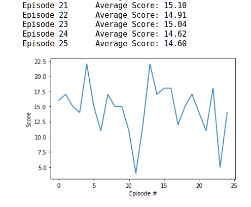

#### Udacity Deep Reinforcement Learning Nanodegree
##### &nbsp;
## Project 1: Navigation
### Train an agent to navigate (and collect bananas!) in a large, square world


***Source: 2. The Environment - Introduction***

##### &nbsp;

## Goal
The goal of the agent is to collect as many yellow bananas as possible while avoiding blue bananas in an environment that is similar to [Unity's Banana Collector environment](https://github.com/Unity-Technologies/ml-agents/blob/master/docs/Learning-Environment-Examples.md#banana-collector).

A reward of +1 is provided for collecting a yellow banana, and a reward of -1 is provided for collecting a blue banana. 

The task is episodic, and in order to solve the environment, the agent must get ***an average score of +13 over 100 consecutive episodes***.

##### &nbsp;

## Solution Approach
Basic steps to build an agent that solves this environment:
(These five map to the 5 steps in the file **`Navigation_Final.ipynb`**.)

1. Start the Environment
2. Examine the State and Action Spaces
3. Take Random Actions in the Environment
4. Train agent to solve the environment!
5. Test the saved agent


### 1. Start the Environment
Here we import the required libraries and create the UnityEnvironment **banana**. Note the Vector Observation space size (per agent) = 37 and Vector Action space size (per agent) = 4.

### 2. Examine the State and Action Spaces
The state space has 37 dimensions and contains the agent's velocity, along with ray-based perception of objects around the agent's forward direction. Given this information, the agent has to learn how to best select actions. Four discrete actions are available, corresponding to:

- `0` move forward
- `1` move backward
- `2` turn left
- `3` turn right

### 3. Take Random Actions in the Environment
The following code - taken from Step 3. of the Navigation project - accomplishes this initial sanity check.

```python
env_info = env.reset(train_mode=False)[brain_name] # reset the environment
state = env_info.vector_observations[0]            # get the current state
score = 0                                          # initialize the score
while True:
    action = np.random.randint(action_size)        # select an action
    env_info = env.step(action)[brain_name]        # send the action to the environment
    next_state = env_info.vector_observations[0]   # get the next state
    reward = env_info.rewards[0]                   # get the reward
    done = env_info.local_done[0]                  # see if episode has finished
    score += reward                                # update the score
    state = next_state                             # roll over the state to next time step
    if done:                                       # exit loop if episode finished
        break

print("Score: {}".format(score))
```

Running the agent produced scores between -2.0 and 2.0. This step is just to ensure that the environment works and that we are ready to try our solution.

### 4. Train agent to solve the environment!
Agents use a policy to decide which actions to take within an environment. The primary objective of the learning algorithm is to find an optimal policy&mdash;i.e., a policy that maximizes the reward for the agent. Since the effects of possible actions aren't known in advance, the optimal policy must be discovered by interacting with the environment and recording observations. Therefore, the agent "learns" the policy through a process of trial-and-error that iteratively maps various environment states to the actions that yield the highest reward. This type of algorithm is called **Q-Learning**.

As for constructing the Q-Learning algorithm, the general approach is to implement a handful of different components, then run a series of tests to determine which combination of components and which hyper-parameters yield the best results.

The following sections describe each component of the DQN algorithm in detail.

#### Q-Function
To discover an optimal policy, set up a Q-function. The Q-function calculates the expected reward `R` for all possible actions `A` in all possible states `S`.


Define the optimal policy `π*` as the action that maximizes the Q-function for a given state across all possible states. The optimal Q-function `Q*(s,a)` maximizes the total expected reward for an agent starting in state `s` and choosing action `a`, then following the optimal policy for each subsequent state.


In order to discount returns at future time steps, the Q-function can be expanded to include the hyper-parameter gamma `γ`.


#### Epsilon-Greedy Algorithm
One challenge with the Q-function above is choosing which action to take while the agent is still learning the optimal policy. Should the agent choose an action based on the Q-values observed thus far? Or, should the agent try a new action in hopes of earning a higher reward? This is known as the **exploration vs. exploitation dilemma**.

To address this, you can implement an **𝛆-greedy algorithm**. This algorithm allows the agent to systematically manage the exploration vs. exploitation trade-off. The agent "explores" by picking a random action with some probability epsilon `𝛜`. However, the agent continues to "exploit" its knowledge of the environment by choosing actions based on the policy with probability (1-𝛜).

Furthermore, the value of epsilon is purposely decayed over time, so that the agent favors exploration during its initial interactions with the environment, but increasingly favors exploitation as it gains more experience. The starting and ending values for epsilon, and the rate at which it decays are three hyper-parameters that are later tuned.

You can find the 𝛆-greedy logic implemented as part of the `agent.act()` method in the file **`dqn_agent.py`**.

#### Deep Q-Network (DQN)
With Deep Q-Learning, a deep neural network is used to approximate the Q-function. Given a network `F`, finding an optimal policy is a matter of finding the best weights `w` such that `F(s,a,w) ≈ Q(s,a)`.

The neural network architecture used for this project can be found in the file **`model.py`**. The network contains three fully-connected layers with 64, 64, and 4 nodes respectively.

### 5. Test the saved agent
The best result (DQN) from Step 4 was an agent able to solve the environment in less than 175 episodes.

The hyper-parameters used were as follows: n_episodes=1000, **eps_start=1.0, eps_end=0.02, eps_decay=0.95**.


In that previous step, note that we saved the agent in the file **`weights/checkpoint.pth`**.

Loading the weights from that checkpoint and running it for 25 episodes produced the following graph.




##### &nbsp;

---

# Project Starter Code
The project starter code can be found below, in case you want to run this project yourself.

Also, the original Udacity repository for this project can be found [here](https://github.com/udacity/deep-reinforcement-learning/tree/master/p1_navigation).


### Getting Started

1. Download the environment from one of the links below.  You need only select the environment that matches your operating system:
    - Linux: [click here](https://s3-us-west-1.amazonaws.com/udacity-drlnd/P1/Banana/Banana_Linux.zip)
    - Mac OSX: [click here](https://s3-us-west-1.amazonaws.com/udacity-drlnd/P1/Banana/Banana.app.zip)
    - Windows (32-bit): [click here](https://s3-us-west-1.amazonaws.com/udacity-drlnd/P1/Banana/Banana_Windows_x86.zip)
    - Windows (64-bit): [click here](https://s3-us-west-1.amazonaws.com/udacity-drlnd/P1/Banana/Banana_Windows_x86_64.zip)

    (_For Windows users_) Check out [this link](https://support.microsoft.com/en-us/help/827218/how-to-determine-whether-a-computer-is-running-a-32-bit-version-or-64) if you need help with determining if your computer is running a 32-bit version or 64-bit version of the Windows operating system.

    (_For AWS_) If you'd like to train the agent on AWS (and have not [enabled a virtual screen](https://github.com/Unity-Technologies/ml-agents/blob/master/docs/Training-on-Amazon-Web-Service.md)), then please use [this link](https://s3-us-west-1.amazonaws.com/udacity-drlnd/P1/Banana/Banana_Linux_NoVis.zip) to obtain the environment.

2. Place the file in the DRLND GitHub repository, in the `p1_navigation/` folder, and unzip (or decompress) the file.

### Instructions

Follow the instructions in `Navigation.ipynb` to get started with training your own agent!  
